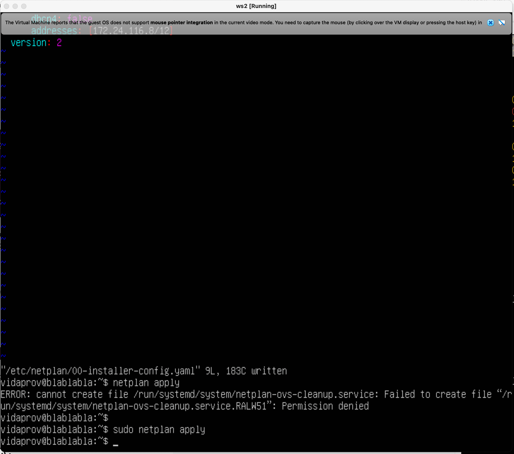
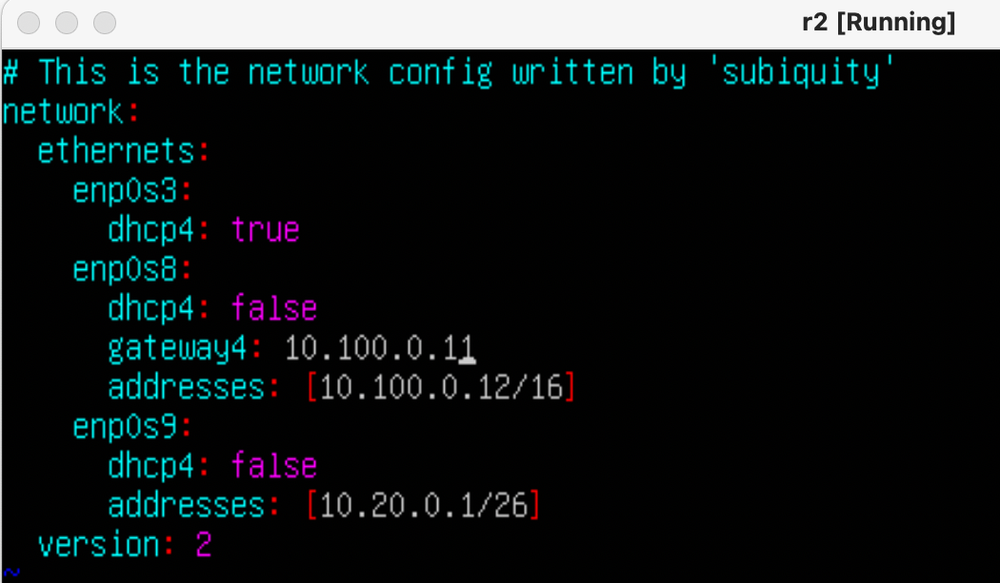
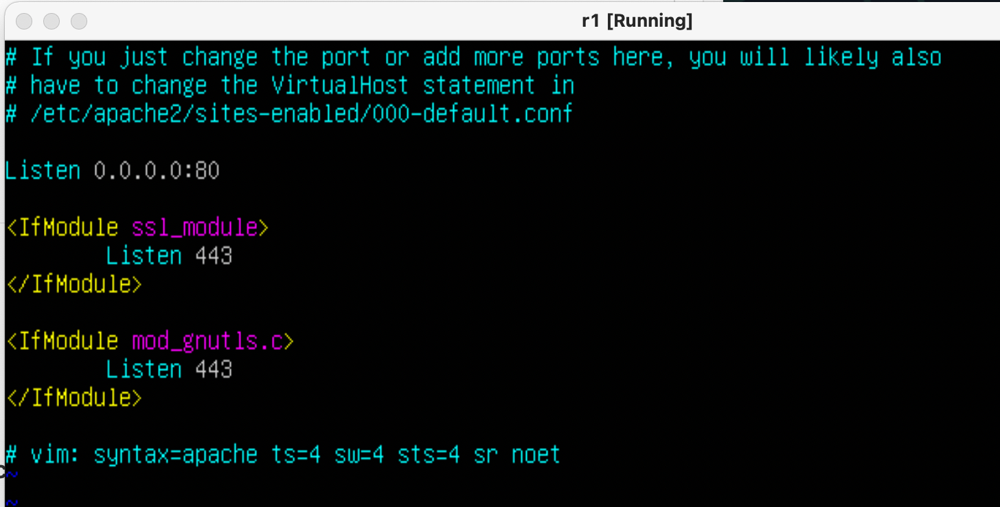

## Задание 1
### 1.1. Сети и маски
#### 1) адрес сети *192.167.38.54/13* = 192.160.0.0/13 (адрес network на скрине)
 (получается через операцию побитового И IP адреса и маски подсети)
#### 2) перевод маски *255.255.255.0* в префиксную и двоичную запись: в префиксную - /24 (так как здесь фиксированы 3 байта), в двоичную - 11111111.11111111.11111111.00000000 как на скрине (строка Netmask)

#### */15* в обычную - 255.254.0.0 и двоичную - 11111111.11111110.00000000.00000000 как на скрине (netmask, если забить как адрес 0.0.0.0/15 или address, если забить как /15)

#### *11111111.11111111.11111111.11110000* в обычную  - 255.255.255.240 (считается переводом двоичного числа в десятичноеб ipcalc здесь для примера)
 и префиксную - /28  (считается как 32 - n, где n - число нулей в маске)
  
#### 3) минимальный и максимальный хост в сети *12.167.38.4* при масках: 
#### */8* - минимальный хост - hostmin, максимальный хост - hostmax

#### *11111111.11111111.00000000.00000000* (она же маска /16)

#### *255.255.254.0* (она же /23)

#### */4*

### 1.2. localhost
#### Определить и записать в отчёт, можно ли обратиться к приложению, работающему на localhost, со следующими IP: *194.34.23.100*, *127.0.0.2*, *127.1.0.1*, *128.0.0.1*

#### Диапазон localhost: 127.0.0.1 - 127.255.255.254
#### в этот диапазон попадают адреса *127.0.0.2*, *127.1.0.1* - по ним можно обратиться
#### адреса *128.0.0.1* и *194.34.23.100* не попадают, по ним обратиться нельзя

### 1.3. Диапазоны и сегменты сетей

#### 1) какие из перечисленных IP можно использовать в качестве публичного, а какие только в качестве частных: *10.0.0.45*, *134.43.0.2*, *192.168.4.2*, *172.20.250.4*, *172.0.2.1*, *192.172.0.1*, *172.68.0.2*, *172.16.255.255*, *10.10.10.10*, *192.169.168.1*
#### Решение: по табличке из интернета (диапазон частных адресов фиксирован)

#### Публичные:*134.43.0.2*, *172.0.2.1*, *192.172.0.1*, *172.68.0.2*, *192.169.168.1*
#### Частные:*10.0.0.45*, *192.168.4.2*, *172.20.250.4*, *172.16.255.255*, *10.10.10.10*
#### 2) какие из перечисленных IP адресов шлюза возможны у сети *10.10.0.0/18*: *10.0.0.1*, *10.10.0.2*, *10.10.10.10*, *10.10.100.1*, *10.10.1.255*
#### Возможны (подходят по маске): *10.10.0.2*, *10.10.0.2*, *10.10.1.255*
#### Невозможны: *10.0.0.1*, *10.10.100.1*

## Задание 2
##### С помощью команды `ip a` посмотреть существующие сетевые интерфейсы
ws1:
ws2:
##### Описать сетевой интерфейс, соответствующий внутренней сети, на обеих машинах и задать следующие адреса и маски: ws1 - *192.168.100.10*, маска */16*, ws2 - *172.24.116.8*, маска */12*
##### Описание: в каждой машине по 3 интерфейса: 
- lo (local loopback), нужен для работы локальных сервисов и приложений по сетевым протоколамб всегда стандартный 
- enp0s3 - интерфейс адаптера, подключен к сети по протоколу dhcp в режиме NAT
- enp0s8 - еще один интерфейс адаптера с заданным статическим адресом (без выхода в интернет)

##### скрины с содержанием изменённого файла *etc/netplan/00-installer-config.yaml* для каждой машины.
ws1: 
ws2: 

##### Выполнить команду `netplan apply` для перезапуска сервиса сети
ws1: 
ws2: 

#### 2.1. Добавление статического маршрута вручную
Перед использованием команды user add нужно настроить интерфейсы машин на внутреннюю сеть
##### Добавить статический маршрут от одной машины до другой и обратно при помощи команды вида `ip r add`
##### Пропинговать соединение между машинами
ws1: 
По команде ip r выведен список адресов (адреса ws2 пока нет). Используем команду sudo ip r add 172.24.116.8 dev enp0s8, снова выводим список рутов через ip r - маршрут появился. Далее пингуем. Аналогично для второй машины
ws2: 

#### 2.2. Добавление статического маршрута с сохранением
##### Перезапустить машины (reboot)
##### Добавить статический маршрут от одной машины до другой с помощью файла *etc/netplan/00-installer-config.yaml*
ws1: 
ws2: 
##### Пропинговать соединение между машинами
ws1: 
ws2: 

## Задание 3
### 3.1. Скорость соединения
#### Перевести и записать: 
- 8 Mbps  = 1 MB/s 
- 100 MB/s = 819200 Kbps
- 1 Gbps = 1024 Mbps

### 3.2. Утилита **iperf3**
#### Измерить скорость соединения между ws1 и ws2
Сначала устанавливаем утилиту по команде sudo apt install iperf3
- Чтобы использовать утилиту и измерить скорость, нужно сначала одну из машин назначить сервером (здесь ws1) по команде iperf3 -s -f K (-s - запуск сервера, -f - вывод в формате Кбайт)
- На ws2 запускаем iperf3 как машину-клиента командой iperf3 -c 192.168.100.10 -f K (используем адрес хоста - 1й машины)

ws1: 
ws2:

## Задание 4
### 4.1. Утилита **iptables**
скрин файлов firewall
ws1: 
ws2: 
применяем команду chmod и запускаем sh:28
ws1: 
ws2: 
- Разница между стратегиями в файлах: при составлении цепочек правил в iptables важна очередность этих правил. Так, фалг -А добавлает правило в конец цепочки. Правила,находящиеся выше по цепочке более приоритетны и исполняются в первую очередь. Поэтому для ws1 все входящие пакеты (в том числе ping) отклоняются, а на ws2 принимаются.

### 4.2. Утилита **nmap**
#### Командой **ping** найти машину, которая не "пингуется", после чего утилитой **nmap** показать, что хост машины запущен
пингуем:
ws1: 
ws2: 
- пингуется только ws2

запускаем  nmap
ws2: 

## Зaдание 5
### 5.1. Настройка адресов машин
#### Настроить конфигурации машин в *etc/netplan/00-installer-config.yaml*
- содержание файла *etc/netplan/00-installer-config.yaml* для каждой машины:

ws11: 
ws21: 
ws22: 
r1: 
r2: 
- Перезапустить сервис сети. Если ошибок нет, то командой `ip -4 a` проверить, что адрес машины задан верно. Также пропинговать ws22 с ws21. Аналогично пропинговать r1 с ws11.

ws11: 
ws21: 
ws22: 
r1: 
r2: 

### 5.2. Включение переадресации IP-адресов.
##### Для включения переадресации IP, выполните команду на роутерах:
`sysctl -w net.ipv4.ip_forward=1`
*При таком подходе переадресация не будет работать после перезагрузки системы.*
r1: 
r2: 
##### Откройте файл */etc/sysctl.conf* и добавьте в него следующую строку:
`net.ipv4.ip_forward = 1`
*При использовании этого подхода, IP-переадресация включена на постоянной основе.*
r1: 
r2: 

### 5.3. Установка маршрута по-умолчанию
#### Настроить маршрут по-умолчанию (шлюз) для рабочих станций. Для этого добавить `default` перед IP роутера в файле конфигураций
##### Вызвать `ip r` и показать, что добавился маршрут в таблицу маршрутизации

ws11:  
ws21:  
ws22:  
r1:  
r2:  

##### Пропинговать с ws11 роутер r2 и показать на r2, что пинг доходит. Для этого использовать команду:
tcpdump -tn -i enp0s8

### 5.4. Добавление статических маршрутов
Добавить в роутеры r1 и r2 статические маршруты в файле конфигураций
r1: 
r2: 

Вызвать `ip r` и показать таблицы с маршрутами на обоих роутерах.
r1: 
r2: 

Запустить команды на ws11:
`ip r list 10.10.0.0/[маска сети]` и `ip r list 0.0.0.0/0`

ws11: 
Для адреса 10.10.0.0/18 был выбран маршрут, отличный от 0.0.0.0/0, так как маршрут по умолчанию имеет меньшую приоритетность. Адрес 10.10.0.0/18 - также адрес сети, поэтому он доступен без шлюза.

### 5.5. Построение списка маршрутизаторов
Запустить на r1 команду дампа tcpdump -tnv -i enp0s8

При помощи утилиты **traceroute** построить список маршрутизаторов на пути от ws11 до ws21

- Принцип построения пути при помощи traceroute:
Для определения промежуточных маршрутизаторов traceroute отправляет целевому узлу серию ICMP-пакетов (по умолчанию 3 пакета), с каждым шагом увеличивая значение поля TTL («время жизни») на 1. Это поле обычно указывает максимальное количество маршрутизаторов, которое может быть пройдено пакетом. Первая серия пакетов отправляется с TTL, равным 1, и поэтому первый же маршрутизатор возвращает обратно ICMP-сообщение «time exceeded in transit», указывающее на невозможность доставки данных. Traceroute фиксирует адрес маршрутизатора, а также время между отправкой пакета и получением ответа (эти сведения выводятся на монитор компьютера). Затем traceroute повторяет отправку серии пакетов, но уже с TTL, равным 2, что заставляет первый маршрутизатор уменьшить TTL пакетов на единицу и направить их ко второму маршрутизатору. Второй маршрутизатор, получив пакеты с TTL=1, так же возвращает «time exceeded in transit». Процесс повторяется до тех пор, пока пакет не достигнет целевого узла. При получении ответа от этого узла процесс трассировки считается завершённым.

### 5.6. Использование протокола **ICMP** при маршрутизации
Запустить на r1 перехват сетевого трафика, проходящего через eth0 с помощью команды tcpdump -n -i enp0s8 icmp
Пропинговать с ws11 несуществующий IP (например, *10.30.0.111*) с помощью команды: ping -c 1 10.30.0.111

## Задание 6. Динамическая настройка IP с помощью **DHCP**
### Для r2 настроить в файле */etc/dhcp/dhcpd.conf* конфигурацию службы **DHCP**:
1) указать адрес маршрутизатора по-умолчанию, DNS-сервер и адрес внутренней сети.
2) в файле *resolv.conf* прописать `nameserver 8.8.8.8.`

Перезагрузить службу **DHCP** командой `systemctl restart isc-dhcp-server`. Машину ws21 перезагрузить при помощи `reboot` и через `ip a` показать, что она получила адрес. Также пропинговать ws22 с ws21.

Указать MAC адрес у ws11, для этого в *etc/netplan/00-installer-config.yaml* надо добавить строки: `macaddress: 10:10:10:10:10:BA`, `dhcp4: true`

Для r1 настроить аналогично r2, но сделать выдачу адресов с жесткой привязкой к MAC-адресу (ws11).

ip a для ws11:

Запросить с ws21 обновление ip адреса

## Задание 7. **NAT**
### В файле */etc/apache2/ports.conf* на ws22 и r1 изменить строку `Listen 80` на `Listen 0.0.0.0:80`, то есть сделать сервер Apache2 общедоступным
r1: 
ws22: 
Запустить веб-сервер Apache командой `service apache2 start` на ws22 и r1
r1: 
ws22: 
Добавить в фаервол, созданный по аналогии с фаерволом из Части 4, на r2 следующие правила:
1) удаление правил в таблице filter - `iptables -F`
2) удаление правил в таблице "NAT" - `iptables -F -t nat`
3) отбрасывать все маршрутизируемые пакеты - `iptables --policy FORWARD DROP`
r2: 
r2: 
Проверить соединение между ws22 и r1 командой `ping`
r1: 
Добавить в файл ещё одно правило:
4) разрешить маршрутизацию всех пакетов протокола **ICMP**
r2: 
Проверить соединение между ws22 и r1 командой `ping`
r1: 
Добавить в файл ещё два правила:
5) включить **SNAT**, а именно маскирование всех локальных ip из локальной сети, находящейся за r2 (по обозначениям из Части 5 - сеть 10.20.0.0)
6) включить **DNAT** на 8080 порт машины r2 и добавить к веб-серверу Apache, запущенному на ws22, доступ извне сети
r2: 
Проверить соединение по TCP для **SNAT**, для этого с ws22 подключиться к серверу Apache на r1 командой:
`telnet [адрес] [порт]`
ws22: 
Проверить соединение по TCP для **DNAT**, для этого с r1 подключиться к серверу Apache на ws22 командой `telnet` (обращаться по адресу r2 и порту 8080)
r1: 

## Задание 8. SSH Tunnels
Запустить на r2 фаервол с правилами из Части 7

r2: 
Запустить веб-сервер **Apache** на ws22 только на localhost (то есть в файле */etc/apache2/ports.conf* изменить строку `Listen 80` на `Listen localhost:80`)
ws22: 

Воспользоваться *Local TCP forwarding* с ws21 до ws22, чтобы получить доступ к веб-серверу на ws22 с ws21
- Команда ssh -L 3333:localhost:80 vidaprov@10.20.0.20
- (вместо 3333 можно поставить любой незанятый порт, по которому пойдет соединение)

Воспользоваться *Remote TCP forwarding* c ws11 до ws22, чтобы получить доступ к веб-серверу на ws22 с ws11
- Команда ssh -R 3333:localhost:80 vidaprov@10.20.0.20

